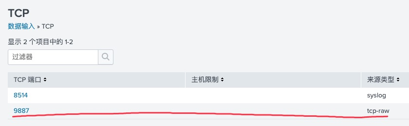

# install in docker
1. From a shell prompt, run the following command to download the required Splunk Enterprise image to your local Docker image library.
    > docker pull splunk/splunk:latest
2. Run the downloaded Docker image.
    > netstat -nap | grep 8000  
    >
    > docker run -d -p 8000:8000 -p 9887:9887 -e SPLUNK_START_ARGS='--accept-license' -e SPLUNK_PASSWORD='\<password\>' splunk/splunk:latest
    * The <password> is the password you want to set for the Splunk Enterprise instance. For information on password requirements, see Configure a Splunk password policy in Authentication.conf in Securing Splunk Enterprise.
    * The port definition -p <host_port>:<container_port> will expose a port used by the containerized application to the outside network by mapping it to port on the local host. In the example above, the SplunkWeb port 8000 is mapped to the host port 8000. If a host port is already occupied by another service, you can use the -p parameter to re-map a port to another open port on the host, example: -p 9000:8000. You can later verify the ports in use by running docker port <container_id>
3. The output of the docker run command is a hash of numbers and letters that represents the container ID of your new Splunk Enterprise instance. Run the following command with the container ID to display the status of the container.
    > docker ps -a -f id=<container_id>
    * To verify the container ID, run docker ps to review the container ID, status, and port mappings of all running containers.
4. Open an web browser on the host and access SplunkWeb inside the container using the address:
    > localhost:8000
    > 172.171.65.124:8000
    > admin/dongxuntech
5. Log in to Splunk Enterprise inside the container using the username admin and the password you set when you ran the Docker image.

### Administer Splunk Enterprise Docker containers
You can use the following Docker commands to manage containers.
* To see a list of example commands and environment variables for running Splunk Enterprise in a container, run:
    > docker run -it splunk/splunk help
* To see a list of your running containers, run:
    > docker ps
* To stop your Splunk Enterprise container, run:
    > docker container stop <container_id>
* To restart a stopped container, run:
    > docker container start <container_id>
* To access a running Splunk Enterprise container to perform administrative tasks, such as modifying configuration files, run:
    > docker exec -it <container_id> bash
